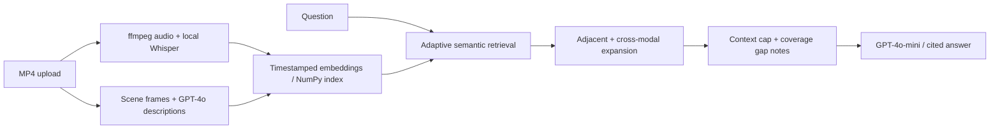

# Skim

**Multimodal video Q&A with adaptive retrieval, timestamp citations, and explicit coverage gaps.**

Upload an `.mp4` and ask about what was said and shown. Skim combines a local
speech transcript with descriptions of sampled frames, retrieves relevant moments,
and generates answers with `[mm:ss]` citations. The Streamlit UI exposes the
transcript, frame previews, and retrieved context for inspection.

Built for tutorials, talks, interviews, and lectures. It reasons from speech and
stills; it cannot reliably measure motion or reconstruct continuous action.

## Demo

https://github.com/user-attachments/assets/aa427b8c-4e61-42d4-a061-319924e03800

## How it works



Speech and visual descriptions share a timeline and a single text-embedding index.
For a question about recipe quantities, speech may identify the relevant step while
a nearby frame description supplies the on-screen numbers. Retrieval expands across
both sequence position and time to bring that evidence together.

## Engineering decisions

- **Adaptive retrieval:** seed count scales with corpus size,
  `clamp(round(sqrt(n) * 1.4), 6, 40)`, addressing fixed-k recall failures found on
  a long, multi-topic video.
- **Adjacent context + temporal fusion:** add two same-modality neighbors on each
  side, then opposite-modality items within +/-10 seconds. This addresses cases where
  a retrieved passage announces an answer that appears in later segments.
- **Controlled context growth:** expansion targets 35% of indexed items, with a
  15-item floor (limited by corpus size), and always retains the seed selection.
  This is an item-count limit, not a token budget.
- **Blind-spot handling:** computed gaps over 20 seconds to the nearest
  opposite-modality item become prompt annotations. The answer prompt asks the
  model to acknowledge missing evidence and motion limitations; this is a guardrail,
  not a guarantee against hallucinations.
- **Reranking tested and rejected as the default:** a local cross-encoder did not
  improve results in the documented experiments. It remains opt-in, with separate
  dependencies. Adjacent-context expansion was retained instead.
- **Practical single-video architecture:** CPU transcription, at most 25 frames
  passed to batched vision, batched chunk embeddings, and an in-memory NumPy index.
  No vector database or persistent app index is required.

See [technical notes](docs/technical-notes.md) for retrieval failure analysis,
experiment history, exact limits, and interview-prep questions.

## Evaluation evidence

The checked-in [dataset](evals/dataset.json) covers **7 videos and 19 questions**:
factual recall, cross-modal reasoning, missing-information honesty, motion blind
spots, and long-video retrieval. It includes French-language Q&A.

The [saved results](evals/results.json) contain answers and `gpt-4o-mini` judge
reasoning. Scores are correct = 1, partial = 0.5, wrong = 0.

| Saved-run score | Skim retrieval | Full-context baseline |
| --- | ---: | ---: |
| All questions | **17.5 / 19** | **17.0 / 19** |
| Long, multi-topic podcast | 4.0 / 4 | 3.5 / 4 |
| Remaining six videos | 13.5 / 15 | 13.5 / 15 |

The baseline uses the same ingested content and answer model, with the entire index
in context. Its prompt differs, so this compares two pipelines rather than isolating
retrieval alone. The half-point difference comes from one podcast question; this
small, judge-scored snapshot does not establish a general quality advantage. Earlier
ablation scores are preserved as historical observations in the technical notes.
No measured latency, cost, or production-scale results are claimed.

## Run locally

Requires **Python 3.11**, `ffmpeg` and `ffprobe` on `PATH`, and an OpenAI API key.

```bash
python -m venv .venv
# macOS / Linux:
source .venv/bin/activate
# Windows PowerShell instead:
# .\.venv\Scripts\Activate.ps1
python -m pip install -r requirements.txt
```

Copy `.env.example` to `.env`, set `OPENAI_API_KEY`, then run:

```bash
python -m streamlit run app.py
```

Start with a short clip. The first transcription downloads the local Whisper
`small` model. Speech stays in local transcription; sampled images, transcript and
frame-description text, questions, and chat context are sent to OpenAI for the
vision, embedding, and answer steps. The UI offers Auto-detect / English / French
and concise / detailed answers.

**Optional reranking:** install `python -m pip install -r requirements-rerank.txt`
and set `SKIM_ENABLE_RERANK=true` in `.env`. The cross-encoder downloads on first
use. The default installation does not require `sentence-transformers` or PyTorch.

## Run evaluations

Provide your own video files at the paths in `evals/dataset.json`; the media and
cached ingestion are gitignored and are not distributed with this repository.
Evaluation requires the same setup and makes OpenAI API calls.

```bash
python -m evals.run_evals            # full suite; writes evals/results_<provider>.json
python -m evals.run_evals --fast     # rice, ted, gelee_groseille; separate results file
python -m evals.run_evals --video ted # single-video smoke test; separate results file
python -m evals.run_evals --no-cache # fresh ingestion; refreshes the cache
```

Transcripts are cached by file content hash **and STT provider**; embeddings,
retrieval, answers, and judging run fresh. Use `--no-cache` after changing ingestion code.
See [evaluation notes](docs/technical-notes.md#evaluation-method-and-reproducibility)
for cache behavior and comparison limits.

### STT provider experiment

ElevenLabs Scribe v2 is available as an alternative transcription backend to
faster-whisper. Both providers use the same downstream retrieval, answering,
and evaluation pipeline.

I compared them on two existing benchmark videos — TED (English) and
`gelee_groseille` (French) — covering 6 questions. After manual inspection,
both providers produced factually correct downstream answers on this small
subset, so the experiment does not demonstrate a QA-quality advantage for
either provider.

Scribe v2 did produce cleaner French transcription on several terms that
Whisper misrecognized, while provider-specific segmentation changed the
retrieval composition. These results are a small engineering experiment, not
a general transcription benchmark.

### Selecting a transcription provider

Whisper remains the default (`small`, CPU, int8). Set these in the gitignored `.env`:

```dotenv
OPENAI_API_KEY=your_openai_key
ELEVENLABS_API_KEY=your_elevenlabs_key
SKIM_STT_PROVIDER=whisper
```

Both providers receive the same mono 16kHz WAV and auto-detect the language.
Selecting ElevenLabs sends that audio to its hosted API; the remaining pipeline
is unchanged.

After installing `requirements.txt`, run these from the project root with the
virtual environment active. In **Windows PowerShell**:

```powershell
$env:SKIM_STT_PROVIDER = "whisper"
python -m evals.run_evals --video ted

$env:SKIM_STT_PROVIDER = "elevenlabs"
python -m evals.run_evals --video ted
```

Use `--video gelee_groseille` for the French clip, or omit `--video` for the full
7-video / 19-question benchmark. Results are written to
`evals/results_<provider>_<video>.json` for a single video and
`evals/results_<provider>.json` for the full suite.

On macOS/Linux use `SKIM_STT_PROVIDER=elevenlabs python -m evals.run_evals --video ted`
and the same environment-prefix pattern for full runs. Shell environment variables
take precedence over `.env`. New experiment results are gitignored; the historical
`evals/results.json` is preserved.

Frame descriptions are shared across providers to keep visual evidence identical.
Keep the cache between comparison runs; `--no-cache` and `--clear-cache` regenerate
visual descriptions and introduce another source of variation.
Keep `SKIM_ENABLE_RERANK` identical in both runs (normally unset/false).

Offline integration checks: `python -m unittest evals.test_stt`.

## Limits and repository map

Frame sampling can miss brief text overlays; transcription can invent speech on
near-silent audio. Citations identify source moments, but their correctness is not
separately scored. The app is a local, session-scoped prototype; long-video processing
still grows with duration, and one long-video eval is limited scale evidence.

| Path | Responsibility |
| --- | --- |
| `app.py` | Upload, language/depth controls, transcript/frames, chat |
| `ingest/` | Audio extraction, transcription, frame sampling and descriptions |
| `index/` | Embeddings, adaptive retrieval, expansion, optional reranking |
| `qa/` | Context formatting, timestamp citations, blind-spot instructions |
| `evals/` | Dataset, full-context baseline, judge harness, saved results |
| [`docs/`](docs/technical-notes.md) | Technical notes, personal project story, archived plans and build log |
